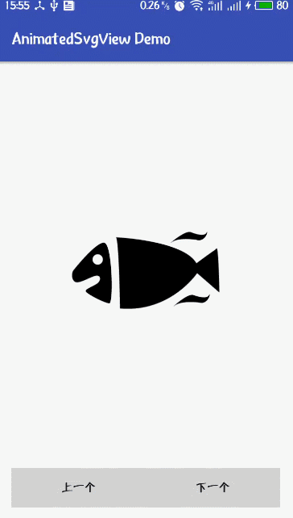
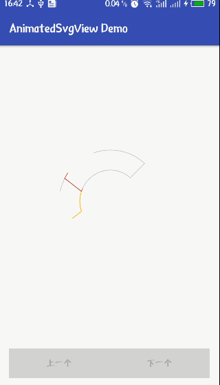

# SVG_Demo
A simple demo of SVG

# Libraries
>com.jrummyapps:animated-svg-view:1.0.1

>com.android.support:animated-vector-drawable:${latest_version}

## Screenshots

##About me
I am a student in China, I love reading novel, love music. 
At the same time, I am also obsessed with writing code.
If you have any new idea about this project,welcome to [contact me:veyron_gz@163.com](mailto:veyron_gz@163.com). :smiley:

In addition, my blog: [http://blog.csdn.net/leaf_130](http://blog.csdn.net/leaf_130)

